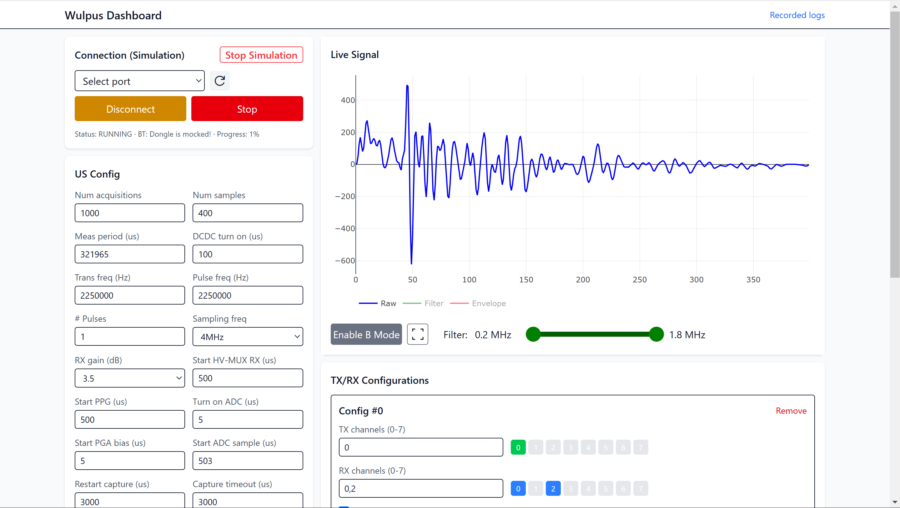

# WULPUS GUI source files
This directory contains the source files for WULPUS Graphical User Interface and an example Jupyter notebook ([wulpus_gui.ipynb](./jupyter%20notebook%20(legacy)/wulpus_gui.ipynb)).

# How to get started?
Follow [HOW_TO_INSTALL](./HOW_TO_INSTALL.md) to install the dependencies.
The jupyter notebook requires only the python dependencies, while the web-based GUI requires also the Node.js-dependencies.




### User-interface
How to Launch the user-interface:

- After completing the initial build, open a new terminal and navigate into `/sw`
- Run the command to laod your anaconda environment:
```
    conda activate wulpus_env
```
- To start the system, execute 
```
    python -m wulpus.main
```
You should be able to open a browser of you choice and visit [http://127.0.0.1:8000/](http://127.0.0.1:8000/)


### Jupyter notebook (legacy)
How to Launch an example Jupyter notebook:
- In a terminal launch 
```
    conda activate wulpus_env
```
- Run the command below:<br>
   (or launch it from Start Menu on Windows:<br>
   *Start -> Anaconda3 -> Jupyter Notebook (wupus_env)*)
```
    jupyter notebook
```
This opens a webpage: Navigate to `dev_pc` folder and click on `wulpus_gui.ipynb`. 
Then, follow the instructions in the Notebook.


# More details
The folder structure inside `/sw` is as follows:
- `wulpus-frontend` is a react (javascript) project which is only the interface you see in your browser
- `wulpus` is a FastAPI server that controls communication with wulpus.
- `jupyter notebook (legacy)` is a standalone python-only solution which uses a jupyter notebook for controlling wulpus. 

During the build-step of `wulpus-frontend`, the build results are copied inside `wulpus\production-frontend`. This is how the frontend can be served from the `wulpus` FastAPI project.


## Development
If you want to work on the frontend, it's easier to just run the backen (`wulpus`) and the frontend (`wulpus-frontend`) seperate.
this way you don't have to build after each step.

You can start the backend as usual (see above `python -m wulpus.main`), but instead of visiting [http://127.0.0.1:8000/](http://127.0.0.1:8000/) in your browser, you start the dev-environment of the frontend:
- Open an additonal terminal at `\sw\wulpus-frontend`
- run 
```
    npm run dev
```
- open the displayed link in your browser (probably [http://localhost:5173/](http://localhost:5173/))

# License
The source files are released under Apache v2.0 (`Apache-2.0`) license unless noted otherwise, please refer to the `sw/LICENSE` file for details.